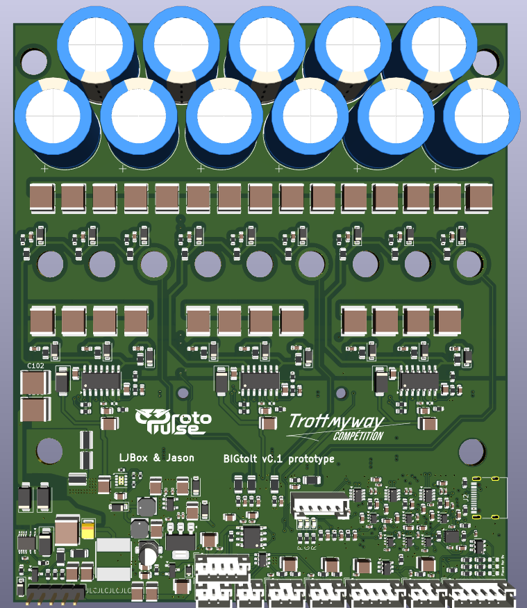
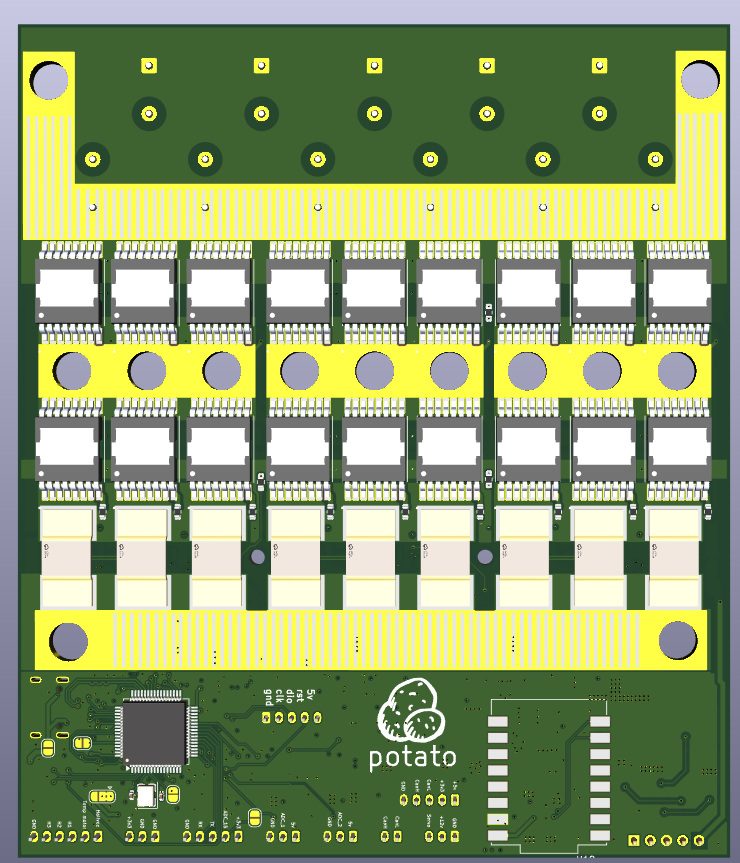

# BigTOLT - Big(kinda) esc with TOLT mosfets

18 mosfet TOLT package esc design based off vesc6 schematic and compatible with [VESC](https://github.com/vedderb/bldc) firmware.

There is also a small high voltage converter used for higher voltage operation, aim was to have a quite big voltage operation range. But if you will test it with high voltage, please do mind that the voltage sensing is **un-isolated**

# Untested !!
This board is not tested but the pcb is ready for prototype. BOM and gerber are in [here](/tolt)

## Board preview

## Liability
This project sources are provided **as is** therfore I, and the co controbutors to this repository shall not be held responsible for any damage occured, including but not limited to hardware damages or other physical injury caused by the outcomes of this source. **You are responsible for your actions. If used wrong, it will go wrong**S